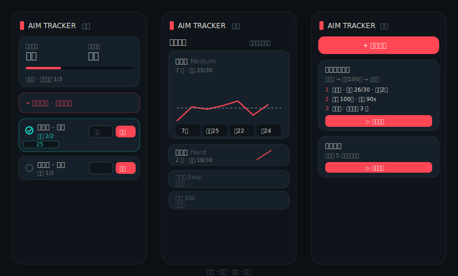

# 🎯 Aim Tracker

> 一款为 **Valorant** 玩家打造的靶场瞄准训练记录 PWA —— 按真实靶场机制记录成绩、评估瞄准段位、追踪成长，并像健身计划一样拼装练枪模板。



数据 **100% 本地存储**（IndexedDB），无需登录、隐私优先，可"添加到主屏幕"离线使用。

---

## ✨ 核心功能

### 段位驱动的自适应训练闭环
录入你的游戏段位 → App 按「下一段位」自动生成今日训练目标 → 每次打完直接填成绩 → 成长曲线累积、段位自动重算 → 段位提升后目标随之升档。

- **双段位对比**：你的实际对战段位 vs 实测瞄准段位，两者可以不同（很多人靠意识吃饭），App 会给出差异解读。
- **成绩↔段位校准表**：段位判定与训练目标都基于一张可视化编辑的校准表，填入你信赖的主播/社区标准即可生效。
- **近期手感**：根据近期段位趋势判断「状态火热 / 稳定 / 手感下滑」。

### 真实靶场机制
精确对应 Valorant 射击场，中英双语对照游戏内设置：

| 测试 | 记录 |
|------|------|
| **速度测试** Easy / Medium / Hard | 30 靶命中数（越高越好） |
| **消灭测试** 50 / 100 | 完成耗时（越低越好），支持正面 / 左侧 / 右侧 |
| 修饰项 | 护甲 Bot Armor、无限弹药 Infinite Ammo、移动靶 Strafe、武器、灵敏度 |

### 训练体验
- **零点击录入**：每个训练项常驻输入框，打完靶直接填数字回车即记一组。
- **健身「组」式**：一个项目一天可打多组，全部保留，统计达标次数。
- **通过条件**：可设「达标 N 次」或「连续达标 N 次」才算通过。
- **拼装式模板**：像加健身动作一样选选项拼出练枪模板，或用内置模板 / 赛前热身一键开练。

### 成长与洞察
- **各项训练**：5 个训练项按练习量排序，点击展开详细趋势图（含下一段位目标线）。
- **灵敏度甜点**：对比不同灵敏度下的平均命中，帮你固定手感。
- **连续打卡**、**个人最佳庆祝**、**数据一键导出**。

---

## 🛠 技术栈

- **React 19** + **TypeScript** + **Vite**
- **Tailwind CSS v4**（暗色 tracker.gg 风格设计系统）
- **Dexie.js**（IndexedDB，offline-first）
- **lucide-react** 图标 · 内联 SVG 图表（零重型图表依赖）
- **vite-plugin-pwa**（Service Worker + 离线缓存 + 可安装）
- **Vitest** 单元测试

## 🚀 本地运行

```bash
npm install
npm run dev        # 开发服务器 http://localhost:5173
npm run build      # 生产构建（生成 PWA）
npm test           # 运行单元测试
```

## 📁 结构速览

```
src/
├── lib/            # 核心逻辑：段位计算、自适应模板、校准表、统计
├── components/     # 训练卡、图表、模板、段位徽章、设置
├── pages/          # 训练 / 成长 / 模板 / 我的
└── data/           # 校准表 + 内置模板（JSON）
```

## 🗺 路线图

- [ ] 模板打卡完成度统计
- [ ] 社区模板广场
- [ ] 可选云同步
- [ ] 多游戏扩展（CS2 / Apex —— 架构已数据驱动，预留切换位）

---

> ⚠️ 瞄准段位为社区/主播标准参考，非官方数据。靶场表现与实战段位并非强相关，请理性看待。
